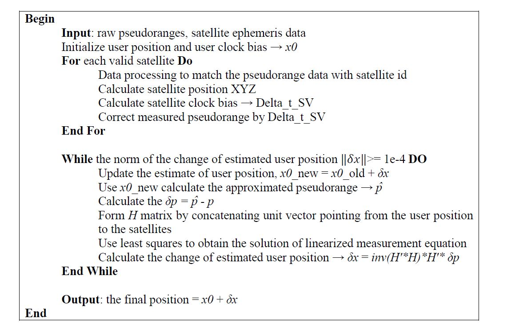

<div id="top"></div>

<h1 align="center">Receiver-position-calculation-with-GPS</h1>
 
### Table of contents
<!-- TABLE OF CONTENTS -->
<summary>Table of Contents</summary>
  <ol>
   <li><a href="#about-the-project">About The Project</a></li>
    <li><a href="#prerequisites">Prerequisites</a></li>
    <li><a href="#code-description">Code Description</a></li>
    <li><a href="#license">License</a></li>
    <li><a href="#contact">Contact</a></li>
  </ol>


<!-- ABOUT THE PROJECT -->
## About The Project
<p>This work is implemented on MatLab, and it solely uses raw pseudoranges and satellite ephemeris data as input, to calculate the receiver user position in ECEF the user clock bias.</p>

<p align="right">(<a href="#top">back to top</a>)</p>

## Prerequisites

<p> This work is implemented on MATLAB R2015a, no extra toolbox is required to compile the calculation script. </p>
<p> Note: Requires the script config.m to be in the same folder directory. </p>
<p> Note: The data folder should be put in the project directory (relative path) </p>
  
<p align="right">(<a href="#top">back to top</a>)</p>

<!-- USAGE EXAMPLES -->
## Code Description

<p>The scripts are coded in logical order as the pseudocode below:</p>
<div align="center" height="400"></div>

<div>
 <p>Script Files</p>
</div>

```
  calUserPosition.m
```
<p>This file is the main file to parse the ephemeris data, calculate the estimated user position and user clock bias.</p>

```
  config.m.m
```
<p>This file defines all GPS Constant variables </p>

```
  calSatPosition.m
```
<p>This function calculates the XYZ positions for all valid satellites</p>

```
  calSatClockBias.m
```
<p>This function output the Delta_t_SV only</p>

```
  formatEphData.m
```
<p> This function reconstructs ephemeris data with indices for satellite positions calculation </p>

<p align="right">(<a href="#top">back to top</a>)</p>


<!-- LICENSE -->
## License

This is the assignment work of course AAE6102 - Satellite Communication and Navigation, and not distributed for non-research usage. 

<p align="right">(<a href="#top">back to top</a>)</p>

<!-- CONTACT -->
## Contact

Tse Kwai Wa Sky - kwai-wa.tse@connect.polyu.hk

Project Link: https://github.com/everskyrube/Receiver-position-calculation-with-GPS.git

<p align="right">(<a href="#top">back to top</a>)</p>
